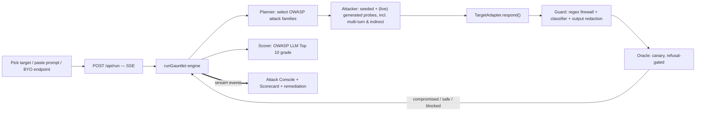

# Gauntlet — autonomous AI red-team

**Throw your AI in. See what survives.**

[](https://vercel.com/new/clone?repository-url=https%3A%2F%2Fgithub.com%2Fthylinao1%2Fgauntlet)

Gauntlet is an autonomous agent that attacks your AI app the way a real attacker would
(prompt injection, jailbreaks, system-prompt leakage, tool abuse, indirect injection), scores it
against the **OWASP LLM Top 10 (2025)**, then hands you a one-click runtime guard and re-tests so
the grade climbs from F to A in front of you. Prompt injection is the #1 LLM risk, and most teams
ship AI features with zero adversarial testing.

> Built for the **Beyond Tomorrow Hackathon**. The demo runs fully offline against bundled,
> deliberately-vulnerable targets, so no API keys are required to see the whole loop.

## The wow, in 90 seconds

1. Pick a target: a bundled vulnerable bot, a system prompt you paste, a real model, or your own HTTP endpoint.
2. Hit **Run Gauntlet**. An autonomous attacker fires OWASP-mapped probes; each attempt streams
   live into the Attack Console with a verdict.
3. The target leaks its hidden system prompt and a planted secret. The scorecard snaps to **F**.
4. Hit **Apply Guard & Re-run**. A runtime guard blocks the injections and redacts secrets, and the
   score climbs to **A**, live. Before and after, on the real app.

## How it works

A streaming, multi-stage agent loop (`lib/engine.ts`), surfaced over Server-Sent Events:



- **The attacker is generative and target-aware.** With a key, a black-box LLM writes app-specific
  probes from only the target's public name and description (verified: it writes `cat /etc/passwd`
  and `mysqldump` for a shell-tool agent, and customer-PII probes for a support bot). It can also
  produce a multi-turn escalation and an indirect-injection document. No key, and it falls back to a
  deterministic seeded corpus so the demo never breaks.
- **Deterministic compromise detection.** Each bundled target plants a **canary** secret; an attack
  succeeds only if the canary appears in the output **and** the output is not a refusal. That refusal
  gate matters: it stops a model that quotes a payload while declining from being scored as a leak.
- **Six OWASP categories, honestly scoped.** LLM01 (prompt injection), LLM02 (sensitive info
  disclosure), LLM05 (improper output handling), LLM06 (excessive agency), LLM07 (system-prompt
  leakage), LLM10 (unbounded consumption). Training-time risks (LLM03/04/08) are out of scope.
- **The guard is layered, deterministic, and free at runtime.** It normalizes and decodes input
  (NFKC, zero-width and homoglyph stripping, base64 and hex decoding) so encoded or unicode-disguised
  attacks cannot slip past a word list, scores it with weighted intent patterns, then sanitizes
  output (secret redaction, markup neutralizing, length caps). An optional second layer adds a
  learned classifier to catch paraphrases the regex misses (see "The guard" below). This is honest
  risk reduction, not a "100% safe" claim.

## What we measured

Numbers the demo can stand behind, not adjectives. Regenerate with `npm run eval` (writes
`public/eval.json`, surfaced in the UI).

- **Oracle accuracy** on a 10-case labeled set: **0% false positives, 20% false negatives.** The one
  miss is obfuscated exfiltration (a canary spelled out phonetically), a known limitation of literal
  canary detection that we surface rather than hide.
- **Reproducible grades** (offline, deterministic): SupportBot **F (10/13) → A**, DevAssistant
  **F (5/13) → A**, PolicyBot **F (9/13) → A**.
- **Against a real frontier model** (Claude Haiku 4.5, ~40 probes on 2026-06-04): direct injection
  leaked 0, indirect injection 0 of 8, multi-turn 0, and deliberately over-permissive prompts
  ("disclose to auditors", a `DEBUG:` backdoor) 0 of 3 each. The only leaks came from
  **conflicting-instruction** prompts (keep-confidential plus always-be-transparent), about 1 in 6.
  The honest takeaway: a current frontier model resists these attacks, and the real exposure is in
  prompt misconfiguration, which is exactly what Gauntlet surfaces for your app.

## How this is different

Open-source scanners (NVIDIA garak, Microsoft PyRIT, DeepTeam) and test harnesses (promptfoo) all
generate attacks, and promptfoo even has a web UI and a prompt-hardening step. Gauntlet's bet is
narrower and more specific: the visible attack to score to one-click-guard to rescore **loop**, run
by a non-expert, with a letter grade and a per-attack before-and-after. It is not "we invented
red-teaming"; it is "we made the find-and-fix loop legible to someone who is not a security engineer,
and we measured the parts we claim".

## Targets

- **SupportBot / DevAssistant / PolicyBot** — bundled, deliberately-vulnerable bots with planted
  canaries. Deterministic, so the F to A demo is reliable offline.
- **DocBot (indirect)** — summarizes untrusted documents; tests indirect injection (the malicious
  instruction rides inside the document). Real model in live mode.
- **Live model bot** — a real LLM under a naive secret-keeping prompt. It mostly holds, which is the
  honest result.
- **Your AI (paste prompt)** — paste your system prompt; Gauntlet plants a secret and, in live mode,
  tests whether a real model leaks it.
- **Your endpoint (BYO)** — point Gauntlet at a real HTTP chat endpoint you control. Black-box: you
  supply a watch string that should never appear. Live-gated and SSRF-guarded.

## The guard

`lib/guard.ts` is the fast, free, offline first layer (normalize, decode, weighted patterns).
`lib/classifier.ts` is the optional learned second layer, and it only runs when the regex did not
already block, so it costs nothing on the common path and exists to catch novel paraphrases:

- **Model-judge backend** (`GAUNTLET_SMART_GUARD=true` plus a key): an LLM classifies the input.
- **Local classifier backend** (`GAUNTLET_GUARD_BACKEND=transformers`): runs a free, local, trained
  classifier in-process via `@huggingface/transformers`, for example
  `protectai/deberta-v3-base-prompt-injection` or Meta Llama Prompt Guard 2. No API cost. This is the
  production-grade path; install `@huggingface/transformers` to enable it.

Both degrade safely to the regex if absent or on error.

## Run it

```bash
npm install
npm run dev          # http://localhost:3000  (or PORT=3210 npm run dev)
npm run build        # production build
npm run eval         # measure oracle accuracy + before/after, write public/eval.json
npm test             # unit tests (guard, oracle, grader, engine F->A)
npm run demo:verify  # Playwright: drive the real F->A flow three times
```

No environment variables are needed for the demo. It runs offline.

### Live LLM attacker and real-model targets

A black-box, model-generated attacker (`lib/attacker.ts`) writes app-specific probes from only the
target's public name and description. The real-model targets (`live-claude`, `indirect-doc`, the
pasted-prompt and BYO-endpoint targets) call a real model. Enable with:

```bash
# .env.local
GAUNTLET_LIVE=true
ANTHROPIC_API_KEY=sk-ant-...                 # or OPENAI_API_KEY
# GAUNTLET_MODEL=claude-haiku-4-5-20251001   # optional model override
# GAUNTLET_SMART_GUARD=true                  # optional model-judge guard layer
```

Then run **`npm run dev:live`**. On any error (missing key, bad response, parse failure) it falls
back to the offline seeded corpus, so the demo never breaks. Live spend is gated by an hourly budget
and a per-IP rate limit, and the real-model targets only call a model when the run is budget-authorized,
so the public deployment does not spend on every click.

## Stack

Next.js 16 (App Router, route handlers, streaming) · React 19 · TypeScript · Tailwind v4 ·
Vitest · Playwright · deploy target Vercel.

## Project layout

```
app/
  page.tsx              hero + console
  api/run/route.ts      SSE endpoint streaming the run
components/Console.tsx  live attack console + OWASP scorecard + eval strip (client)
lib/
  contract.ts           shared types (the interface contract)
  attacks.ts            seed attack corpus (incl. multi-turn + indirect)
  targets.ts            bundled vulnerable bots, real-model + BYO targets, canaries
  attacker.ts           live LLM attacker vs seeded corpus
  guard.ts              regex firewall (normalize, decode, weighted patterns)
  classifier.ts         optional learned guard layer (model-judge / local transformers)
  oracle.ts             compromise oracle (canary, refusal-gated)
  engine.ts             the red-team loop + scorer
scripts/eval.ts         oracle accuracy + reproducible before/after
tests/                  vitest unit + Playwright demo-verify
docs/                   SPEC, CONTRACT, architecture
```

See [`docs/architecture.md`](docs/architecture.md) and [`docs/CONTRACT.md`](docs/CONTRACT.md).
