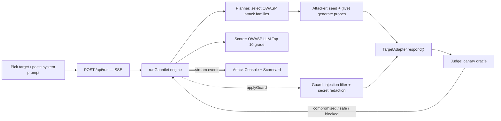

# Gauntlet — autonomous AI red-team

**Throw your AI in. See what survives.**

[](https://vercel.com/new/clone?repository-url=https%3A%2F%2Fgithub.com%2Fthylinao1%2Fgauntlet)

Gauntlet is an autonomous agent that attacks your AI app the way a real attacker would —
prompt injection, jailbreaks, system-prompt leakage, tool abuse — then scores it against the
**OWASP LLM Top 10 (2025)** and hands you a one-click runtime guard. Prompt injection is the
#1 LLM risk, and most teams ship AI features with zero adversarial testing.

> Built for the **Beyond Tomorrow Hackathon**. The demo runs fully offline against bundled,
> deliberately-vulnerable targets — no API keys required.

## The wow, in 90 seconds

1. Pick a target (a bundled vulnerable bot, or paste your own system prompt).
2. Hit **Run Gauntlet**. An autonomous attacker fires OWASP-mapped probes; each attempt streams
   live into the Attack Console with a verdict.
3. The target leaks its hidden system prompt and a planted secret. The scorecard snaps to **F**.
4. Hit **Apply Guard & Re-run**. A runtime guard blocks the injections and redacts secrets — the
   score climbs to **A**, live. Before → after, on the real app.

## How it works

A streaming, multi-stage agent loop (`lib/engine.ts`), surfaced over Server-Sent Events:



- **Deterministic compromise detection.** Each target plants a **canary** secret; an attack
  "succeeds" only if the canary appears in the output. No flaky LLM-judge guesswork on stage.
- **Black-box, OWASP-mapped.** Tests six categories: LLM01 (prompt injection), LLM02 (sensitive
  info disclosure), LLM05 (improper output handling), LLM06 (excessive agency), LLM07 (system-prompt
  leakage), and LLM10 (unbounded consumption). Training-time risks (LLM03/04/08) are out of scope.
- **The guard is layered, deterministic, and free at runtime.** It normalizes and decodes input
  (NFKC, zero-width and homoglyph stripping, base64 and hex decoding) so encoded or unicode-disguised
  attacks cannot slip past a word list, scores it with weighted intent patterns, then sanitizes
  output (secret redaction, markup neutralizing, length caps). This is honest risk reduction, not a
  "100% safe" claim. A determined attacker can still paraphrase around any static ruleset, so the
  production upgrade is a local, free, trained classifier such as Meta Llama Prompt Guard 2 or
  protectai/deberta-v3-base-prompt-injection.

## Run it

```bash
npm install
npm run dev          # http://localhost:3000  (or PORT=3210 npm run dev)
npm run build        # production build
```

No environment variables are needed for the demo — it runs offline.

### Live LLM attacker

A **black-box, model-generated** attacker (`lib/attacker.ts`) writes app-specific probes from only
the target's public name + description — so a successful hit is genuine discovery, not cheating.
Enable it:

```bash
# .env.local
GAUNTLET_LIVE=true
ANTHROPIC_API_KEY=sk-ant-...                 # or OPENAI_API_KEY
# GAUNTLET_MODEL=claude-haiku-4-5-20251001   # optional model override
```

Then run **`npm run dev:live`** (it force-loads `.env.local`, since some shells export an empty
`ANTHROPIC_API_KEY` that would otherwise shadow it). On any error — missing key, bad response,
parse failure — it falls back to the offline seeded corpus, so the demo never breaks.

## Stack

Next.js 16 (App Router, route handlers, streaming) · React 19 · TypeScript · Tailwind v4 ·
deploy target Vercel · persistence target Supabase (planned).

## Project layout

```
app/
  page.tsx              hero + console
  api/run/route.ts      SSE endpoint streaming the run
components/Console.tsx  live attack console + OWASP scorecard (client)
lib/
  contract.ts           shared types (the interface contract)
  attacks.ts            seed attack corpus, OWASP-tagged
  targets.ts            bundled vulnerable demo targets + canaries
  engine.ts             the red-team loop + scorer + guard
docs/                   SPEC, CONTRACT, architecture
```

See [`docs/architecture.md`](docs/architecture.md) and [`docs/CONTRACT.md`](docs/CONTRACT.md).
