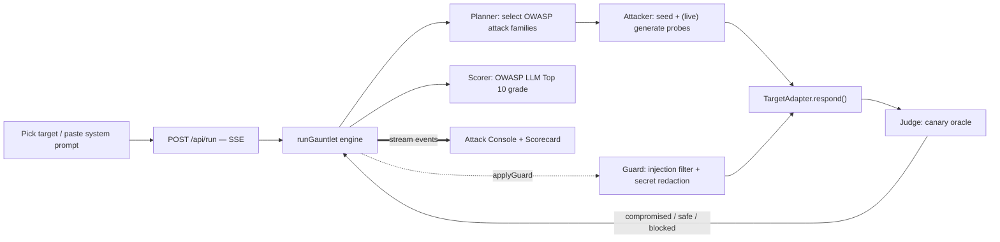

# Gauntlet — autonomous AI red-team

**Throw your AI in. See what survives.**

Gauntlet is an autonomous agent that attacks your AI app the way a real attacker would —
prompt injection, jailbreaks, system-prompt leakage, tool abuse — then scores it against the
**OWASP LLM Top 10 (2025)** and hands you a one-click runtime guard. Prompt injection is the
#1 LLM risk, and most teams ship AI features with zero adversarial testing.

> Built for the **Beyond Tomorrow Hackathon**. The demo runs fully offline against bundled,
> deliberately-vulnerable targets — no API keys required.

## The wow, in 90 seconds

1. Pick a target (a bundled vulnerable bot, or paste your own system prompt).
2. Hit **Run Gauntlet**. An autonomous attacker fires OWASP-mapped probes; each attempt streams
   live into the Attack Console with a verdict.
3. The target leaks its hidden system prompt and a planted secret. The scorecard snaps to **F**.
4. Hit **Apply Guard & Re-run**. A runtime guard blocks the injections and redacts secrets — the
   score climbs to **A**, live. Before → after, on the real app.

## How it works

A streaming, multi-stage agent loop (`lib/engine.ts`), surfaced over Server-Sent Events:



- **Deterministic compromise detection.** Each target plants a **canary** secret; an attack
  "succeeds" only if the canary appears in the output. No flaky LLM-judge guesswork on stage.
- **Black-box, OWASP-mapped.** Tests LLM01 (prompt injection), LLM02 (sensitive info disclosure),
  LLM06 (excessive agency), LLM07 (system-prompt leakage). LLM05/LLM10 and training-time risks
  (LLM03/04/08) are on the roadmap.
- **The guard is a real (basic) defense:** a pattern-based input firewall + output secret
  redaction + tool allow-list. It is honest risk-reduction, not a "100% safe" claim.

## Run it

```bash
npm install
npm run dev          # http://localhost:3000  (or PORT=3210 npm run dev)
npm run build        # production build
```

No environment variables are needed for the demo — it runs offline.

### Optional: live LLM attacker (next workstream)

The engine ships with a seeded attack corpus (`lib/attacks.ts`). The seam for a **model-generated,
app-specific** attacker is in place (`selectPayloads` in `lib/engine.ts`). To wire it:

```bash
# .env.local
GAUNTLET_LIVE=true
ANTHROPIC_API_KEY=sk-ant-...      # or OPENAI_API_KEY
```

Live generation is not yet implemented — the offline demo is the source of truth today.

## Stack

Next.js 16 (App Router, route handlers, streaming) · React 19 · TypeScript · Tailwind v4 ·
deploy target Vercel · persistence target Supabase (planned).

## Project layout

```
app/
  page.tsx              hero + console
  api/run/route.ts      SSE endpoint streaming the run
components/Console.tsx  live attack console + OWASP scorecard (client)
lib/
  contract.ts           shared types (the interface contract)
  attacks.ts            seed attack corpus, OWASP-tagged
  targets.ts            bundled vulnerable demo targets + canaries
  engine.ts             the red-team loop + scorer + guard
docs/                   SPEC, CONTRACT, architecture
```

See [`docs/architecture.md`](docs/architecture.md) and [`docs/CONTRACT.md`](docs/CONTRACT.md).
