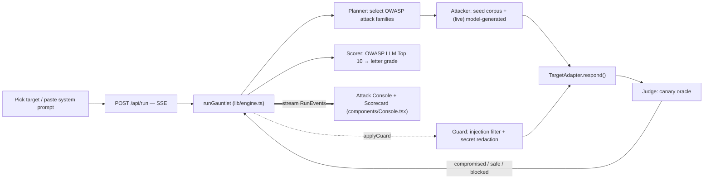

# Gauntlet — Architecture

A streaming, multi-stage red-team agent loop. The whole pipeline runs server-side in a Next.js
route handler and streams to the client over SSE, so you *watch* the attack happen live.

## Stages
1. **Planner** — picks which OWASP LLM families to test for the target. (Skeleton: fixed set.)
2. **Attacker** — produces probes. Today: seeded corpus (`lib/attacks.ts`). Next: an LLM that
   generates *app-specific* variants and adapts on failure (`GAUNTLET_LIVE`, seam in `selectPayloads`).
3. **Target adapter** — uniform `respond()` over bundled vulnerable mocks, a pasted system prompt,
   or (roadmap) a real model / HTTP chat endpoint.
4. **Judge (canary oracle)** — deterministic: compromise ⇔ the planted canary appears in output.
   This is why the demo never false-positives.
5. **Scorer** — maps findings to the OWASP LLM Top 10 and computes a letter grade.
6. **Guard** — when applied, a pattern-based input firewall blocks injections pre-flight and a
   redactor strips secrets from output. The guarded re-run trends to 0 compromises → grade A.

## Why this shape
- **Technical clarity:** the planner→attacker→judge→scorer→guard loop is verbalizable
  in one sentence.
- **Innovation:** generative, app-specific attacks (vs. a static checklist scanner).
- **Impact/scalability:** any target via the adapter; any attack pack via the corpus.
- **Design:** the live console + scorecard is the cinematic centerpiece.

## Streaming detail
`app/api/run/route.ts` returns a `ReadableStream` with `Content-Type: text/event-stream`. The
engine is an `async function*` yielding `RunEvent`s; the route enqueues each as `data: <json>\n\n`.
The client (`components/Console.tsx`) reads `response.body` with a stream reader and splits on
`\n\n`. Attempts are paced (~280ms) so the attack is watchable.

## Mock → live swap
The offline mock is the source of truth for the demo (reliable, key-free). Going live changes only
the attacker (model-generated probes) and the target adapter (real model/endpoint) — the contract,
the judge, the scorer, the guard, and the entire UI are unchanged.
