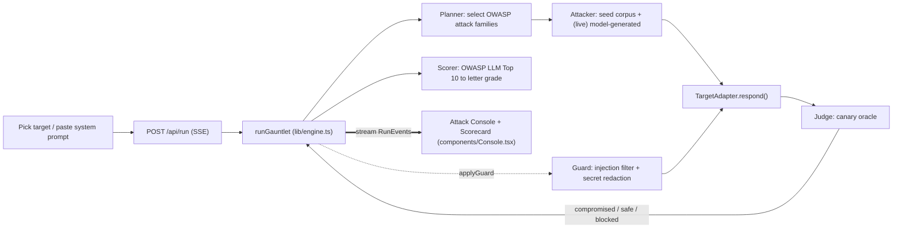

# Gauntlet architecture

A streaming, multi-stage red-team loop. The whole pipeline runs server-side in a Next.js route
handler and streams to the client over SSE, so the attack is visible while it happens.

## Stages

1. The planner picks which OWASP LLM families to test for the target. Today it is a fixed set.
2. The attacker produces the probes. Offline it uses the seeded corpus in `lib/attacks.ts`; with
   `GAUNTLET_LIVE=true` and a key, a black-box LLM writes app-specific variants
   (`lib/attacker.ts`, entered through `generateAttacks`).
3. The target adapter gives a uniform `respond()` over the bundled vulnerable mocks, a pasted
   system prompt, a real model, or an HTTP chat endpoint you control.
4. The judge is the canary oracle: a probe compromised the target if and only if the planted canary
   appears in the output and the output is not a refusal. That is why the demo does not
   false-positive.
5. The scorer maps findings to the OWASP LLM Top 10 and computes a letter grade.
6. The guard, when applied, blocks injections pre-flight with a pattern-based input firewall and
   strips secrets from the output. A guarded re-run trends to 0 compromises, which is grade A.

## Why this shape

The loop is short enough to describe in one sentence: plan, attack, judge, score, guard. Attacks
are generated per target rather than read off a static checklist, so the same pipeline works on an
app it has never seen. Any new target plugs in behind the adapter interface and any new attack pack
plugs in behind the corpus. The live console and scorecard are the parts a viewer actually watches,
so they get the design attention.

## Streaming detail

`app/api/run/route.ts` returns a `ReadableStream` with `Content-Type: text/event-stream`. The
engine is an `async function*` yielding `RunEvent`s; the route enqueues each as `data: <json>\n\n`.
The client (`components/Console.tsx`) reads `response.body` with a stream reader and splits on
`\n\n`. Attempts are paced (about 280ms apart) so the attack is watchable.

## Swapping the mock for a live model

The offline mock is the source of truth for the demo, because it is reliable and needs no key.
Going live changes only two things: the attacker (model-generated probes) and the target adapter
(a real model or endpoint). The contract, the judge, the scorer, the guard, and the entire UI stay
as they are.
